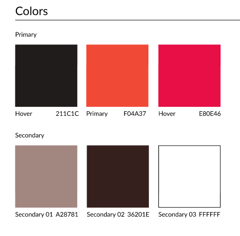

# Práctica 5.1 sobre Componentes

 **S2DAW Diseño Web**
 > Autores: Alejandro Sánchez & Hugo Lancha

### 1. Descripción

Se trata de un proyecto en el cual vamos a hacer al menos 5 componentes en **react** con variables de **tailwindcss** que han sido exportadas de **figma**. El objetivo de la página es realizar un diseño primero en Figma y crear 5 componentes y variables con colores, tamaños, etc... Más tarde, exportar esas variables a tailwindcss y mediante React hacer esos componentes aplicando las variables exportadas.

### 2. Diseño en Figma

En figma podemos encontrar los siguientes apartados

- **Paleta de colores**
  
  Hemos obtado por una paleta de rojos combinado con algunos colores negrizos
  

### 2. Enlaces
[Enlace a Figma](https://www.figma.com/design/Ogur1ugUm2QcReImxpfBqN/Untitled?node-id=5-193&t=235uqHd9IAk0tsSj-1)

