# Práctica 5.1 sobre Componentes

 **S2DAW Diseño Web**
 > Autores: Alejandro Sánchez & Hugo Lancha

### 1. Descripción

Se trata de un proyecto en el cual vamos a hacer al menos 5 componentes en **react** con variables de **tailwindcss** que han sido exportadas de **figma**. El objetivo de la página es realizar un diseño primero en Figma y crear 5 componentes y variables con colores, tamaños, etc... Más tarde, exportar esas variables a tailwindcss y mediante React hacer esos componentes aplicando las variables exportadas.

### 2. Diseño en Figma

En figma podemos encontrar los siguientes apartados

- **Paleta de colores**
  

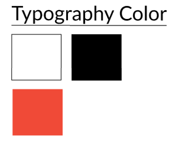

  - Los colores en variables de tailwindcss quedaría
  
  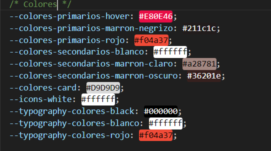
  
  Hemos obtado por una paleta de rojos combinado con algunos colores negrizos

- **Font family**
  - **Lato**: Se tratará de la fuente que se usará en la mayor parte de la página web
  - **Arsenal SC**: Una segunda fuente vistosa para por ejemplo encabezados
 
- **Tamaños de fuente**
  
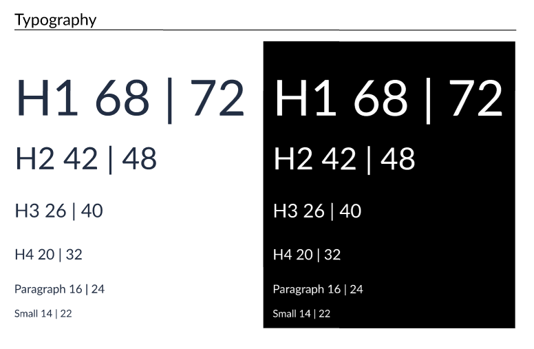

  - Estas variables exportadas a tailwindcss quedarían
  
  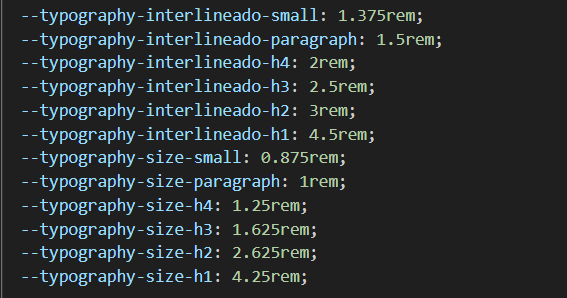

- **Peso en la fuente**
  - **Bold**
  - **Regular**
  - **Semi Bold**
  - **Extra light**

  - En tailwindcss quedaría
  
  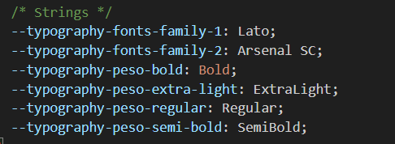

- **Componentes (Al menos 5)**
  - **Botón de Login**
 
  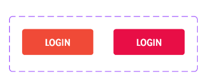

  - **Card**

  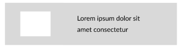

  
  - **Input**
 
  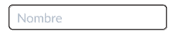

  - **Header**
 
  

  - **Footer**

  

### 3. Diseño en React
 - **Botón de Login**
 
  

  - **Card**

  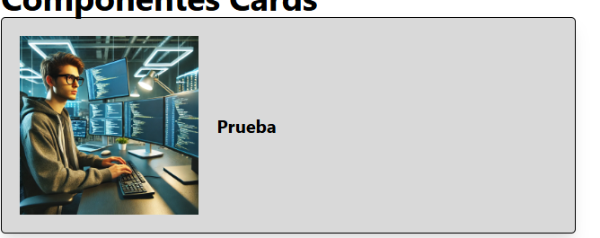

  
  - **Input**
 
  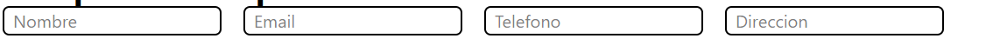

  - **Header**
 
  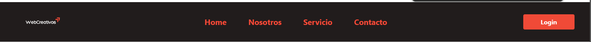

  - **Footer**

  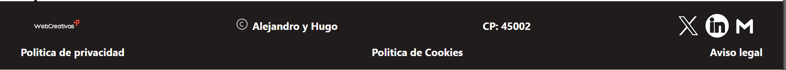

### 4. Enlaces
[Enlace a Figma](https://www.figma.com/design/Ogur1ugUm2QcReImxpfBqN/Untitled?node-id=5-193&t=235uqHd9IAk0tsSj-1)

